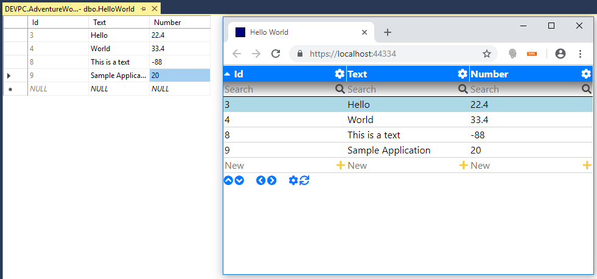
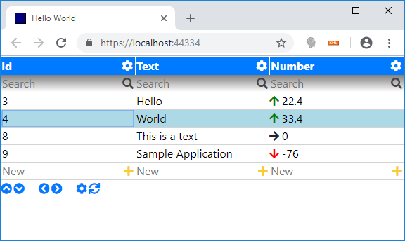

---
title: Code
path: code
pageindex: 10
active: 1
--- 

# Code Examples

Following simple code examples help to get started with the framework.

* [Hello World](#hello-world) Show simple hello world text on application
* [Data Grid](#data-grid) Let's add an sql server data grid to the web application
* [Data Annotation](#data-annotation) (Green arrow up for positive numbers)

## Hello World

Render simple "Hello World" text to the web application. The class AppMain represents the main application and derives from frameworks AppJson class. The parameterless constructor is used for json deserialization. The second constructor is used when the object is created programmatically. For example with the extension method ComponentCreate();

```csharp
public class AppMain : AppJson
{
    public AppMain() : this(null) { }

    public AppMain(ComponentJson owner) : base(owner) { }

    protected override Task InitAsync()
    {
        this.ComponentCreate<Html>().TextHtml = "Hello World!";
        return base.InitAsync();
    }
}
```

## Data Grid
Now let's add a data grid to our web application. The extension method ComponentCreate<Grid>(); creates a reference point in our json component tree. The method LoadAsync(); initiates the loading of data. In the method GridQuery(); we define the linq query to be executed (either to database or in memory). Additionally in this example we do a primary filtering on "IsActive" records.

```csharp
public class AppMain : AppJson
{
    public AppMain() : this(null) { }

    public AppMain(ComponentJson owner) : base(owner) { }

    protected override async Task InitAsync()
    {
        // Create a reference point in component tree and initiate loading.
        await this.ComponentCreate<Grid>().LoadAsync(); 
    }

    protected override IQueryable GridQuery(Grid grid)
    {
        // Define the linq query.
        return UtilDal.Query<HelloWorld>().Where(item => item.IsActive == true); 
    }
}
```

Following screenshot shows on the left hand side Management Studio with the data table and on the right hand side the same table in the web application.

By default it comes with

* Paging
* Sorting
* Filtering
* Adding new records



Following command line command generates for every table and view a Csharp code class in the file "Application\Application.Database\Database.cs"

```powershell
.\cli.cmd generate
```


## Data Annotation

Now lets add some annotation. If the number is positive it should show a green arrow up and if the number is negative a red arrow down. For this we override the method GridCellAnnotation(); like this:

```csharp
protected override void GridCellAnnotation(Grid grid, string fieldName, GridRowEnum gridRowEnum, Row row, GridCellAnnotationResult result)
{
    HelloWorld helloWorld = row as HelloWorld;
    if (fieldName == nameof(HelloWorld.Number))
    {
        if (helloWorld?.Number > 0)
        {
            result.HtmlLeft = "<i class='fas fa-arrow-up green'></i>";
        }
        if (helloWorld?.Number < 0)
        {
            result.HtmlLeft = "<i class='fas fa-arrow-down red'></i>";
        }
        if (helloWorld?.Number == 0)
        {
            result.HtmlLeft = "<i class='fas fa-arrow-right'></i>";
        }
    }
}
```

Arrow icons are provided by Font Awesome. The framework uses by default the web site template at "Application\Website" (which can be viewed and edited with "npm start" command). In the styles.css we add the two css classes ".red" and ".green". 

```css
.red {
    color: red;
}

.green {
    color: green;
}
```

After template changes it is necessary to run the command line build command ("-c" parameter stands for build web client only)

```powershell
.\cli.cmd build -c
```

Now the data grid looks like this:


