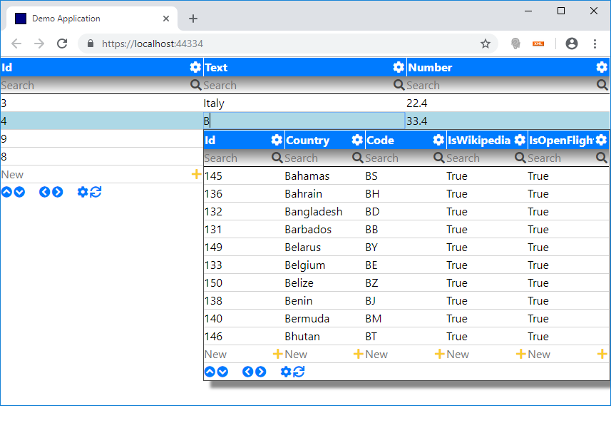

---
title: Code
path: code
pageindex: 10
active: 1
--- 

# Code Examples

Following simple code examples help to get started with the framework.

* [Hello World Text](#hello-world-text) (Show simple hello world text)
* [Data Grid](#data-grid) (Add sql server data grid to web application)
* [Data Annotation](#data-annotation) (Green arrow up for positive numbers)
* [Data Lookup Window](#data-lookup-window) (Data lookup up or autocomplete window)
* [Customize Design](#customize-design) (Change web site template)

## Hello World Text

Render simple "Hello World" text to the web application. The class AppMain represents the main application and derives from frameworks AppJson class. The parameterless constructor is used for json deserialization. The second constructor is used when the object is created programmatically. For example with the extension method ComponentCreate();

```csharp
public class AppMain : AppJson
{
    public AppMain() : this(null) { }

    public AppMain(ComponentJson owner) : base(owner) { }

    protected override Task InitAsync()
    {
        this.ComponentCreate<Html>().TextHtml = "Hello World!";
        return base.InitAsync();
    }
}
```

## Data Grid
Now let's add a data grid to our web application. The extension method ComponentCreate<Grid>(); creates a reference point in our json component tree. The method LoadAsync(); initiates the loading of data. In the method GridQuery(); we define the linq query to be executed (either to database or in memory). Additionally, in this example we do a primary filtering on "IsActive" records and sort the grid by default by the column "Text".

```csharp
public class AppMain : AppJson
{
    public AppMain() : this(null) { }

    public AppMain(ComponentJson owner) : base(owner) { }

    protected override async Task InitAsync()
    {
        // Create a reference point in component tree and initiate loading.
        await this.ComponentCreate<Grid>().LoadAsync(); 
    }

    protected override IQueryable GridQuery(Grid grid)
    {
        // Define the linq query with default sorting.
        return UtilDal.Query<HelloWorld>().Where(item => item.IsActive == true).OrderBy(item => item.Text);
    }
}
```

Following screenshot shows on the left-hand side Management Studio with the data table and on the right-hand side the same table in the web application.

By default it comes with

* Paging
* Sorting
* Filtering
* Adding new records


Following command line command generates for every table and view a Csharp code class in the file "Application\Application.Database\Database.cs"

```powershell
.\cli.cmd generate
```


## Data Annotation
Adding visual icons to your data application brings a lot of benefits. For example just adding the phone icon [Font Awesome phone](https://fontawesome.com/icons/phone?style=solid) to the telephone column makes it look much more appealing to the end user.

Now let's consider another example. If for example the number is positive a green arrow up should be shown and if the number is negative a red arrow down should be shown. For this we override the method GridCellAnnotation(); like this:

```csharp
protected override void GridCellAnnotation(Grid grid, string fieldName, GridRowEnum gridRowEnum, Row row, GridCellAnnotationResult result)
{
    HelloWorld helloWorld = row as HelloWorld;
    if (fieldName == nameof(HelloWorld.Number))
    {
        if (helloWorld?.Number > 0)
        {
            result.HtmlLeft = "<i class='fas fa-arrow-up green'></i>";
        }
        if (helloWorld?.Number < 0)
        {
            result.HtmlLeft = "<i class='fas fa-arrow-down red'></i>";
        }
        if (helloWorld?.Number == 0)
        {
            result.HtmlLeft = "<i class='fas fa-arrow-right'></i>";
        }
    }
}
```

Now the data grid looks like this:


# Data Lookup Window

Auto complete or data lookup windows allow users to select items from dynamic lists. Following code example shows the column "Text" with a country auto complete window.

Override the method GridLookupQuery(); to return the query for the look up window. And finally override the method GridLookupSelected(); to return the text that should go into the edit cell.

public class AppMain : AppJson
{
	public AppMain() : this(null) { }

	public AppMain(ComponentJson owner) : base(owner) { }

	protected override async Task InitAsync()
	{
		await this.ComponentCreate<Grid>().LoadAsync();
	}

	protected override IQueryable GridQuery(Grid grid)
	{
		return UtilDal.Query<HelloWorld>().OrderBy(item => item.Text);
	}

	protected override IQueryable GridLookupQuery(Grid grid, Row row, string fieldName, string text)
	{
		if (fieldName == nameof(HelloWorld.Text))
		{
			// Return country query for look up window on column "Text".
			return UtilDal.Query<CountryDisplay>().Where(item => item.Country.StartsWith(text)).OrderBy(item => item.Country);
		}
		return null; // No lookup for other data columns
	}

	protected override string GridLookupSelected(Grid grid, Row row, string fieldName, Row rowLookupSelected)
	{
		// User clicked a country row in the lookup window. Return the text that should go into the edit cell.
		return ((CountryDisplay)rowLookupSelected).Country;
	}
}



# Customize Design

The web site template is found at folder "Application\Website\". To develop and change the design type 

```cmd
npm start
```

An empty web site with styles, Bootstrap and Font Awesome references is shown at: http://localhost:8081/. The framework replaces the html tag "data-app" with the application. In order to change the color of the arrows in the example above update the style.css file like this:

```
.red {
    color: red;
}

.green {
    color: green;
}
```

After changing the template, it is necessary to run the command line build command ("-c" parameter stands for build web client only)

```powershell
.\cli.cmd build -c
```

