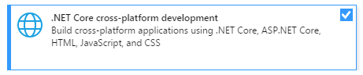
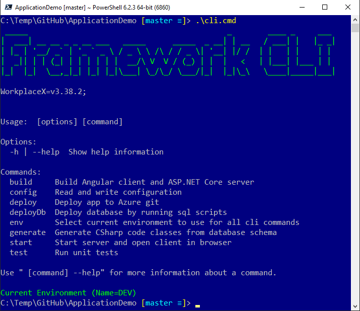

---
title: Install
path: install
pageindex: 05
active: 1
--- 

# Getting Started
Web "Demo Application" is a comprehensive example to get started with. The following two components need to be installed on the machine as prerequisite:

* [Node.js](https://nodejs.org/en/) (LTS Version)
* [.NET Core](https://dotnet.microsoft.com/download) (Version 2.1)

## Tools
The web "Demo Application" can be started from command prompt without Visual Studio being installed. It needs only access to an MS-SQL Server. For development the following tools are recommended:
* [MS-SQL Server](https://www.microsoft.com/en-us/sql-server/sql-server-downloads) (Works with developer edition).
* [SQL Server Management Studio](https://docs.microsoft.com/sql/ssms/download-sql-server-management-studio-ssms) (SSMS)
* [Visual Studio](https://visualstudio.microsoft.com/vs/) (Works with community edition). Install the following component:



## Video Tutorial
Following short 2:30 minutes video shows step by step installation process of git clone, build, deploy and starting the web application.

<div class="youtube-container">
<iframe width="560" height="315" src="https://www.youtube.com/embed/bYJTl5axgUY" frameborder="0" allow="accelerometer; autoplay; encrypted-media; gyroscope; picture-in-picture" allowfullscreen></iframe>
</div>

## Git Clone
```cmd
git clone https://github.com/WorkplaceX/ApplicationDemo.git --recursive
```
Argument "--Recursive" clones also necessary submodule "Framework".

## Command Line Interface (CLI)
The framework provides a command line interface (CLI) with all necessary functions like build, deploy and so on. In the root folder type cli.
```cmd
cd ApplicationDemo
.\cli.cmd
```
All available framework CLI commands are listed like this:



## Build
Build the application from command line:
```cmd
.\cli.cmd build
```

## ConnectionString
Set ConnectionString with command line interface:
```cmd
.\cli.cmd config ConnectionString="Data Source=localhost; Initial Catalog=Application; Integrated Security=True;"
```

It creates or updates the files: "ConfigCli.json" and "ConfigWebServer.json".

{:.note}
**Note:** Why does "ConfigCli.json" and "ConfigWebServer.json" have two ConnectionStrings? The framework needs a couple of sql tables (prefixed with "Framework") to run. These tables can be deployed to a second, separate (empty) database. This makes it possible to wiretap an existing production database initially with a ready only user login. Like this it's possible to test and demonstrate the frameworks capabilities to customers in a non-critical way.

## Deploy Sql Tables
Run sql deploy script from command line interface to deploy necessary sql tables and views to database.
```cmd
.\cli.cmd deployDb
```

{:.note}
**Note:** You can run the command "deployDb" multiple times. The database table "FrameworkScript" keeps track of the executed scripts. No script is executed twice on the same database. The sql scripts are in folder: "Application.Cli\SqlScript\"

## Start
Serve the application from command line:
```cmd
.\cli.cmd start
```

Web browser opens on "http://localhost:56098/" and serves "Demo" application.

## Custom Sql Table and View

Finally let's wiretap any other sql table or view on the database.

Following cli command generates for every table and view in the database a C# class in the file "Application\Application.Database\Database.cs"

```cmd
.\cli.cmd generate
```

Follow this article on how to display an sql table or view in the web application: **[Code Examples](code.md)**
